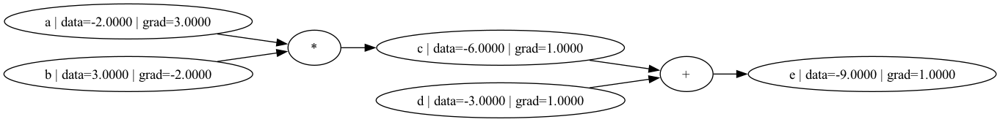

# ml.fitness

A hands-on journey through neural networks and deep learning, following Andrej Karpathy's [Neural Networks: Zero to Hero](https://karpathy.ai) course.

## Roadmap

| Lecture | Topic | Status |
|---------|-------|--------|
| 1 | Backpropagation & autograd from scratch | ✅ |
| 2–N | Building GPT from scratch | 🔜 |

## Lecture 1 — Micrograd: Backpropagation from scratch

A minimal scalar-valued autograd engine built from first principles.

**What's implemented:**
- `Value` — a scalar node that tracks data, gradient, parent nodes, and the operation that produced it
- `+` and `*` operators with automatic gradient accumulation
- `backward()` — reverse-mode autodiff via topological sort
- `trace()` — computation graph visualization with Graphviz

**Example:**

```python
from autograd.main import Value, trace

a = Value(-2.0, label='a')
b = Value(3.0,  label='b')
c = a * b;  c.label = 'c'
d = Value(-3.0, label='d')
e = c + d;  e.label = 'e'

e.backward()
print(a)  # Value(a | data=-2.0 | grad=-3.0)
print(e)  # Value(e | data=-9.0 | grad=1.0)
trace(e)  # saves images/graph.png
```

**Computation graph:**



## Setup

```bash
pip install -r requirements.txt
python autograd/main.py
```

Requires Graphviz system binary: `brew install graphviz` (macOS) or `apt install graphviz` (Linux).

## References

- [micrograd](https://github.com/karpathy/micrograd) — Andrej Karpathy's original implementation
- [Neural Networks: Zero to Hero](https://github.com/karpathy/nn-zero-to-hero) — course notebooks
